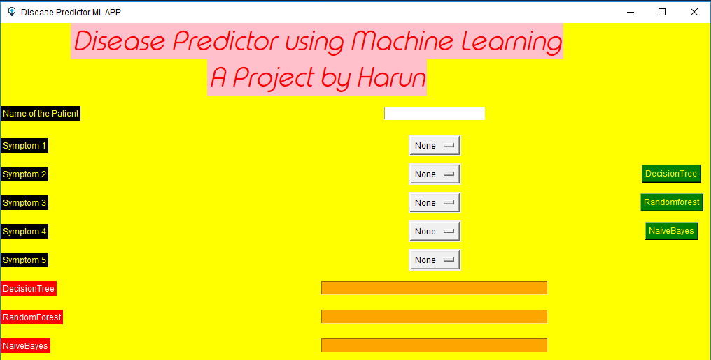
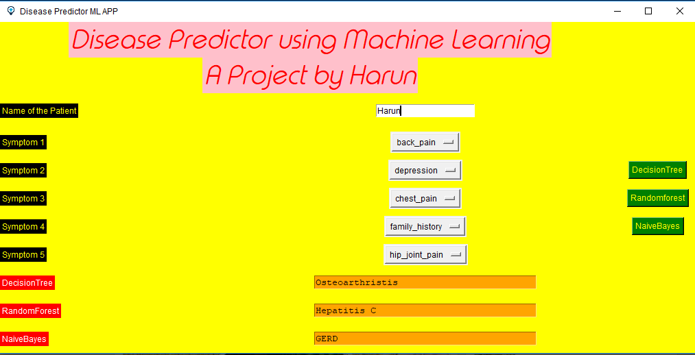

# Disease-prediction-using-Machine-Learning
This Machine Learning project is used to predict the disease based on the symptoms given by the user.It predicts using three different machine learning algorithms.So,the output is accurate.It uses tkinter for GUI.

